# 📚 E-Perpustakaan — Sistem Manajemen Perpustakaan Digital

> Sistem manajemen perpustakaan berbasis web modern yang dibangun menggunakan Laravel, Inertia.js, dan Vue.js. Cocok untuk perpustakaan sekolah atau instansi pendidikan.

🌐 **Akses Online:** [https://perpusukk-production.up.railway.app/](https://perpusukk-production.up.railway.app/)

---

## 📸 Screenshot Aplikasi

### 🏠 Halaman Utama (Landing Page)
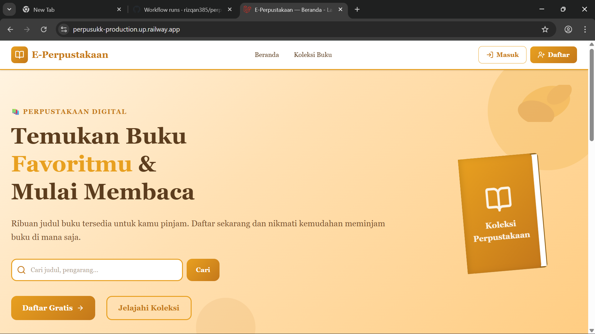

### 🔐 Registrasi & Verifikasi OTP
| Registrasi | Verifikasi OTP |
|---|---|
| 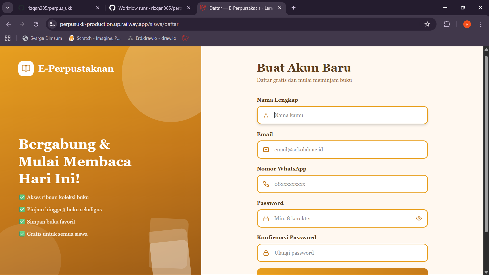 | 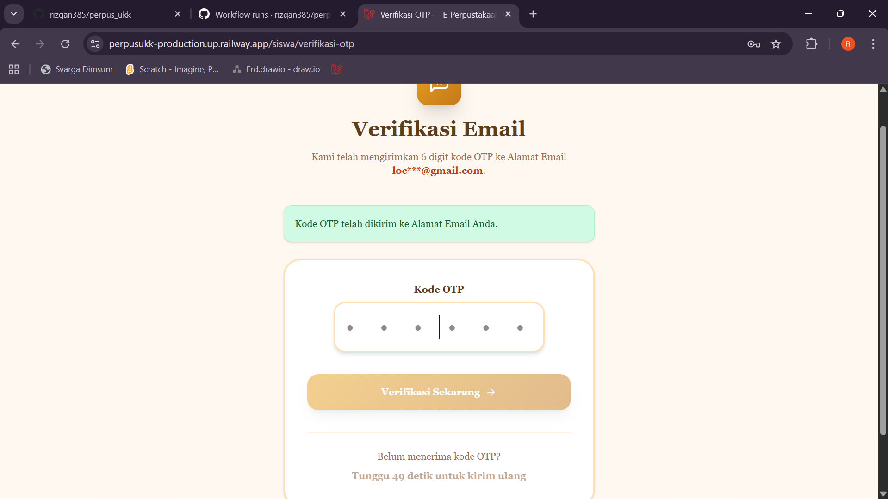 |

### 🎛️ Dashboard Admin
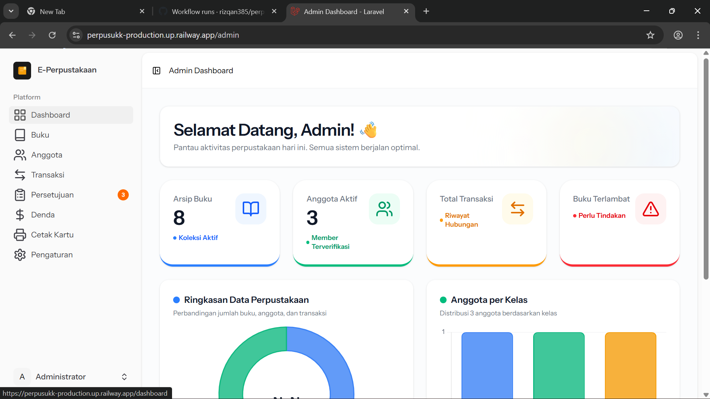

### 📖 Manajemen Buku & Koleksi
| Koleksi Buku | Detail Buku |
|---|---|
| 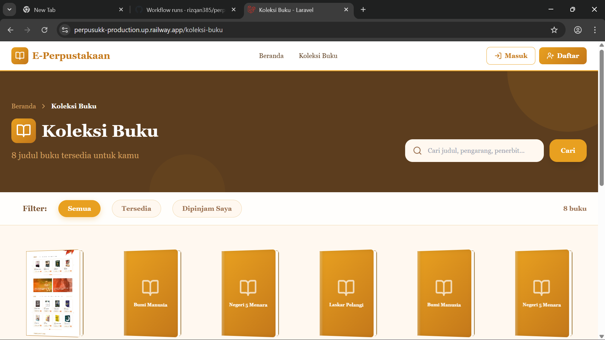 | 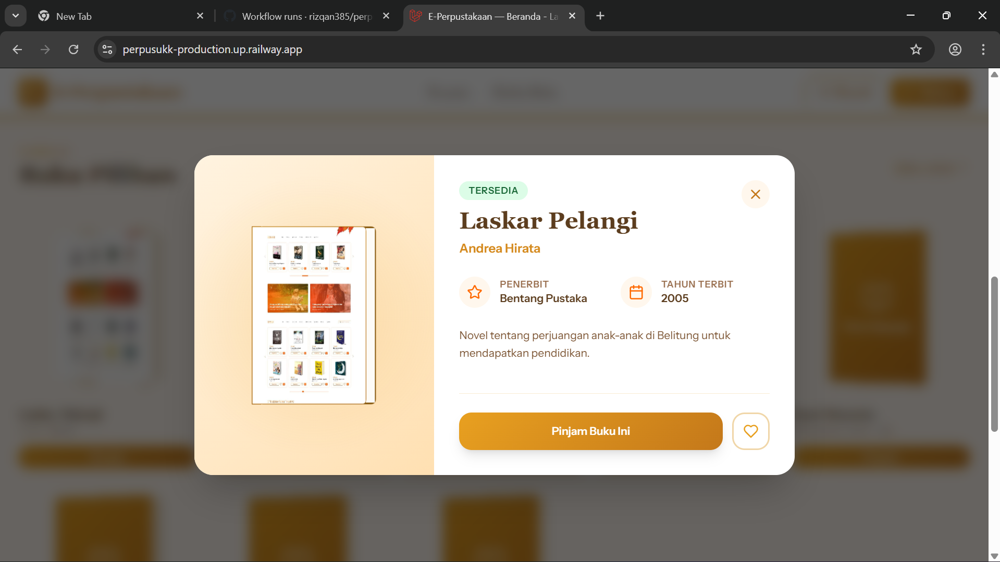 |

### 👥 Manajemen Anggota & Kartu Anggota
| Data Anggota | Cetak Kartu |
|---|---|
| 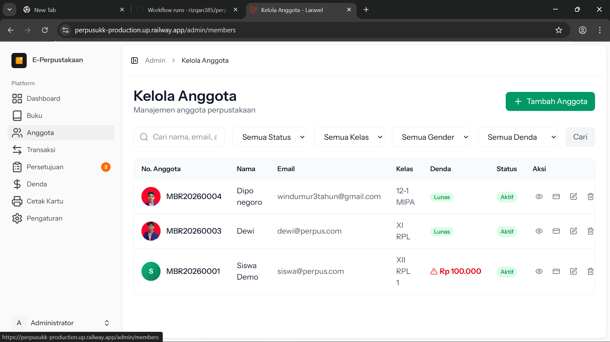 | 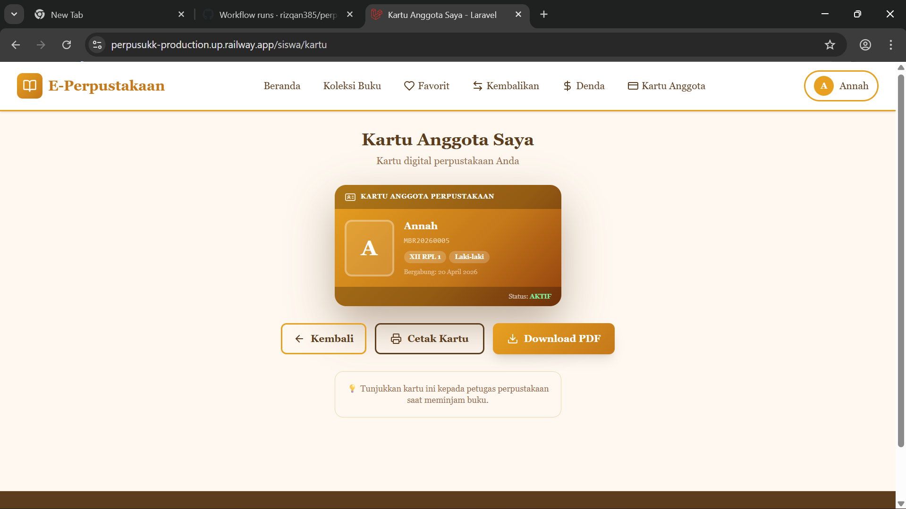 |

### 📋 Peminjaman & Persetujuan
| Data Buku | Persetujuan Admin |
|---|---|
| 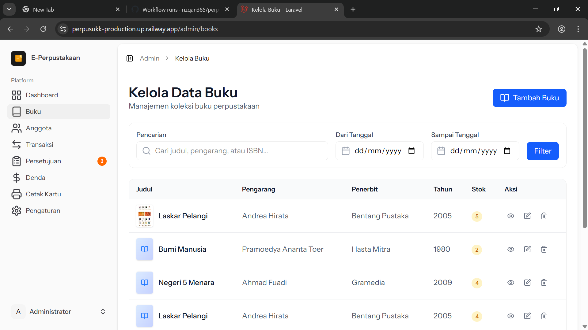 | 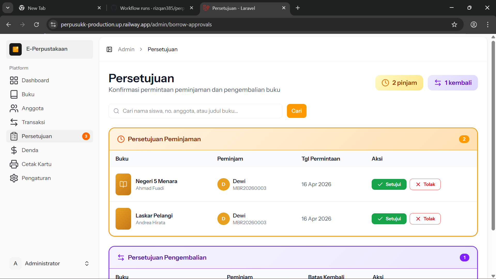 |

### 💰 Denda & Transaksi
| Denda Admin | Denda Siswa | Transaksi |
|---|---|---|
| 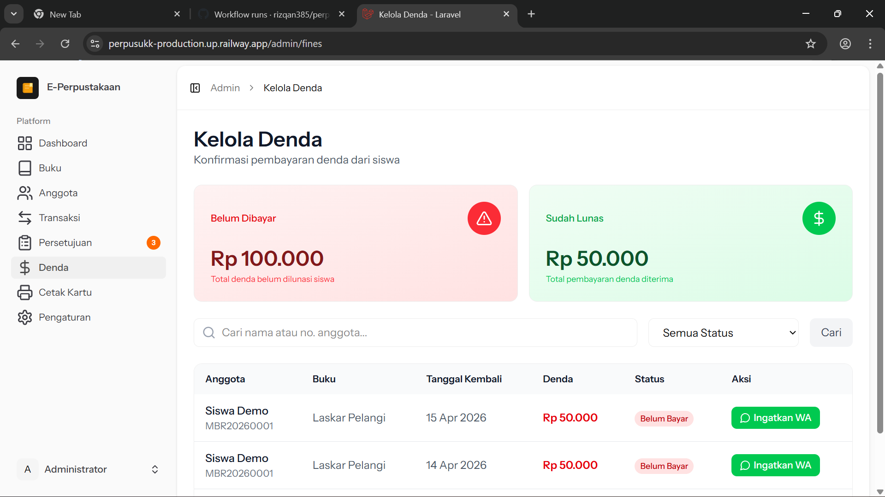 | 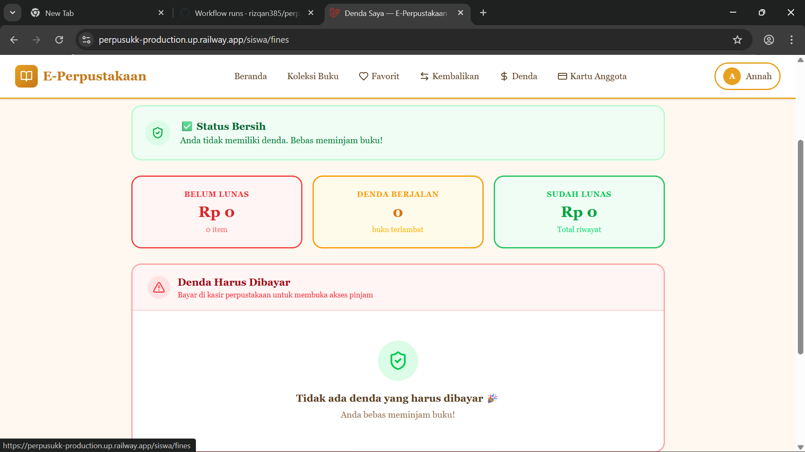 | 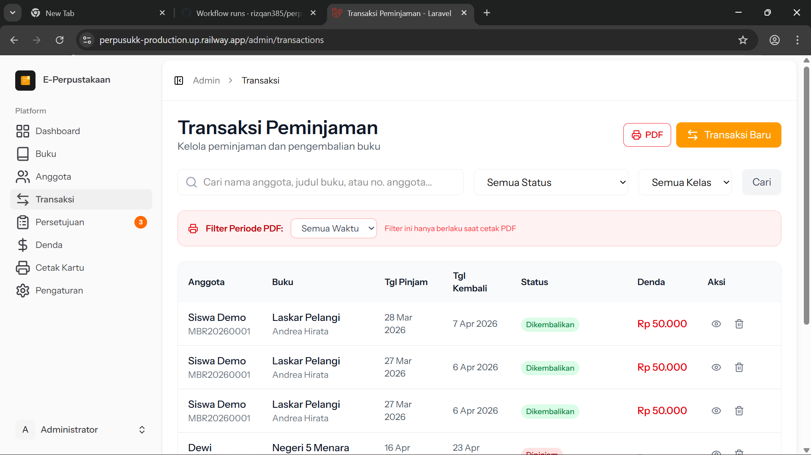 |

### 📚 Fitur Siswa
| Katalog | Favorit | Kembalikan Buku |
|---|---|---|
| 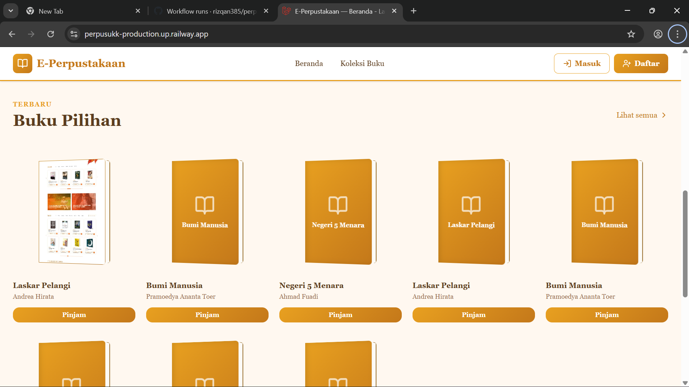 | 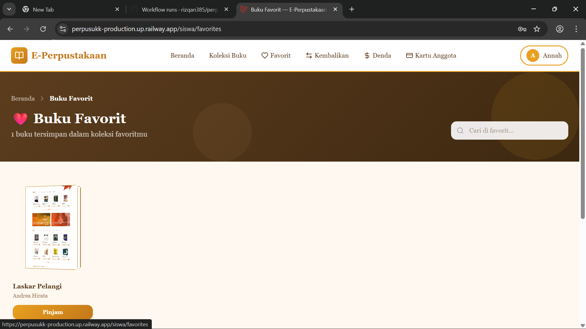 | 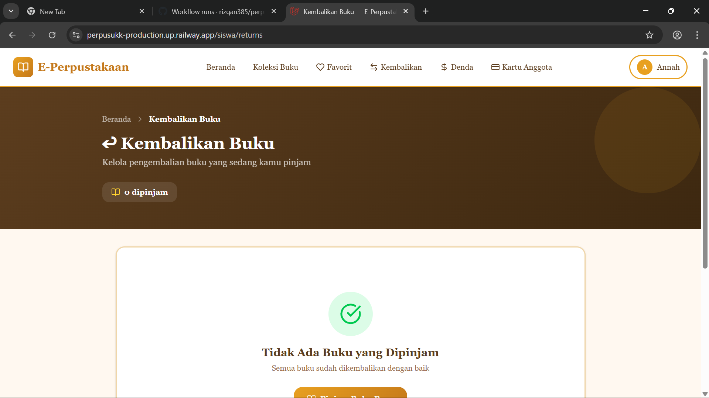 |

### ⚙️ Pengaturan & Cetak
| Pengaturan | Cetak Laporan |
|---|---|
| 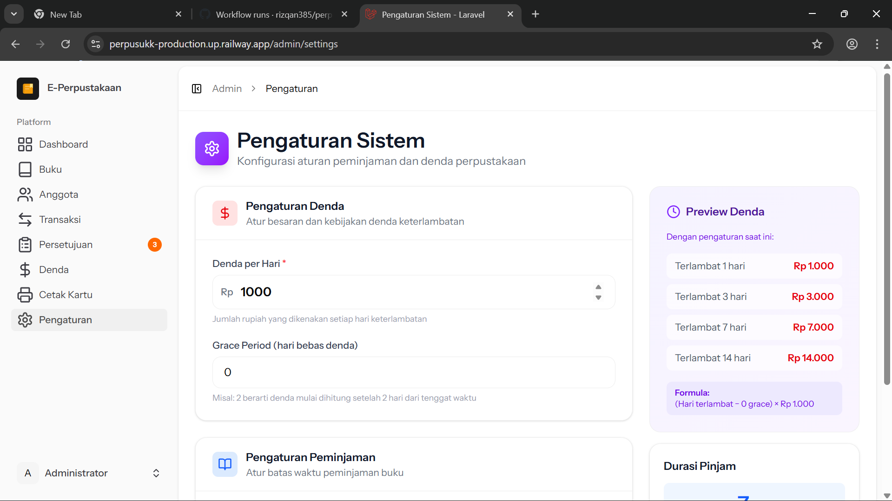 | 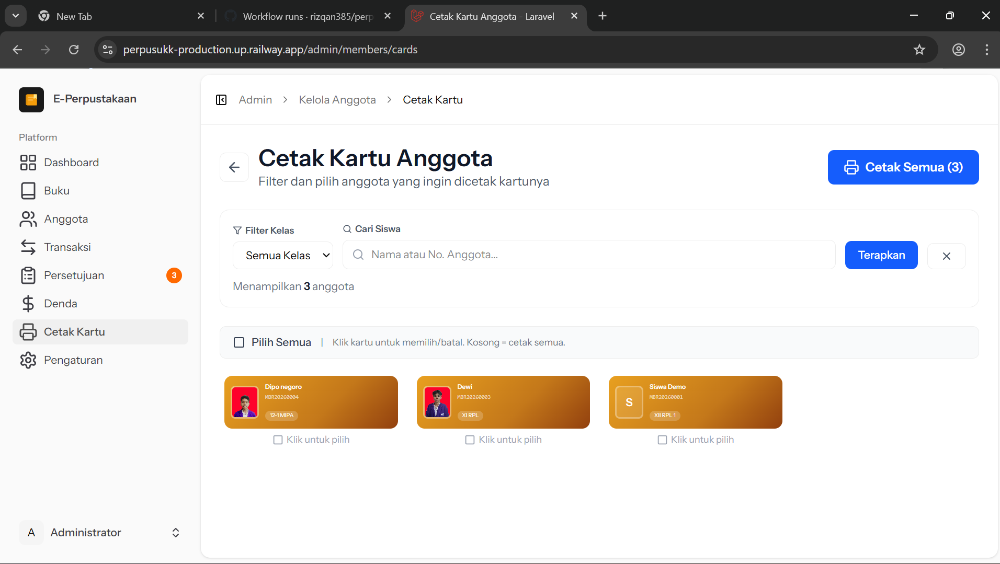 |

---

## 🛠️ Teknologi yang Digunakan

| Teknologi | Versi | Keterangan |
|---|---|---|
| **PHP** | ^8.2 | Bahasa pemrograman backend |
| **Laravel** | ^12.0 | Framework PHP |
| **Inertia.js** | ^2.0 | Jembatan Laravel + Vue |
| **Vue.js** | ^3.0 | Framework JavaScript frontend |
| **TypeScript** | ^5.0 | Superset JavaScript |
| **Vite** | ^6.0 | Build tool frontend |
| **MySQL** | 8.0+ | Database |
| **Tailwind CSS** | ^3.0 | Utility CSS framework |
| **Lucide Vue** | latest | Icon library |
| **Midtrans** | latest | Payment gateway (denda) |
| **Fonnte** | latest | Notifikasi WhatsApp OTP |

---

## ⚙️ Instalasi & Setup

### Prasyarat

Pastikan sistem kamu sudah terinstall:
- **PHP** >= 8.2
- **Composer** >= 2.0
- **Node.js** >= 20.x & **npm**
- **MySQL** >= 8.0
- **Git**

### Langkah 1: Clone Repository

```bash
git clone https://github.com/rizqan385/perpus_ukk.git
cd perpus_ukk
```

### Langkah 2: Install Dependensi PHP

```bash
composer install
```

### Langkah 3: Install Dependensi Node.js

```bash
npm install
```

### Langkah 4: Salin File Environment

```bash
cp .env.example .env
```

### Langkah 5: Generate Application Key

```bash
php artisan key:generate
```

### Langkah 6: Konfigurasi Database

Edit file `.env` dan sesuaikan pengaturan database:

```env
DB_CONNECTION=mysql
DB_HOST=127.0.0.1
DB_PORT=3306
DB_DATABASE=perpus_ukk
DB_USERNAME=root
DB_PASSWORD=
```

### Langkah 7: Jalankan Migrasi & Seeder

```bash
php artisan migrate --seed
```

### Langkah 8: Buat Symbolic Link Storage

```bash
php artisan storage:link
```

### Langkah 9: Build Frontend (Development)

```bash
npm run dev
```

### Langkah 10: Jalankan Aplikasi

```bash
php artisan serve
```

Akses aplikasi di: **http://localhost:8000**

---

## 🔑 Akun Default

Setelah menjalankan seeder, akun default tersedia:

| Role | Email | Password |
|---|---|---|
| **Admin** | `admin@perpus.com` | `password` |
| **Siswa** | (Daftar via halaman registrasi) | - |

---

## 📬 Konfigurasi Notifikasi (Opsional)

### WhatsApp (Fonnte)
Daftar di [https://fonnte.com](https://fonnte.com) untuk mendapatkan token API.

```env
FONNTE_TOKEN=your_fonnte_token_here
FONNTE_URL=https://api.fonnte.com/send
```

### Email (SMTP Gmail)
Gunakan **App Password** Google (bukan password utama).

```env
MAIL_MAILER=smtp
MAIL_HOST=smtp.gmail.com
MAIL_PORT=587
MAIL_USERNAME=your_email@gmail.com
MAIL_PASSWORD=your_app_password
MAIL_ENCRYPTION=tls
MAIL_FROM_ADDRESS=your_email@gmail.com
MAIL_FROM_NAME="E-Perpustakaan"
```

### Payment Gateway (Midtrans)
Daftar di [https://midtrans.com](https://midtrans.com) untuk pembayaran denda online.

```env
MIDTRANS_SERVER_KEY=your_server_key
MIDTRANS_CLIENT_KEY=your_client_key
MIDTRANS_IS_PRODUCTION=false
```

---

## 🚀 Fitur Utama

### 👨‍💼 Panel Admin
- ✅ **Dashboard** — Statistik buku, anggota, dan peminjaman
- ✅ **Manajemen Buku** — Tambah, edit, hapus koleksi buku dengan upload cover
- ✅ **Manajemen Anggota** — CRUD data anggota, cetak kartu anggota
- ✅ **Persetujuan Peminjaman** — Setujui atau tolak request peminjaman siswa
- ✅ **Persetujuan Pengembalian** — Konfirmasi pengembalian buku dari siswa
- ✅ **Manajemen Denda** — Perhitungan denda otomatis, pembayaran via Midtrans
- ✅ **Laporan & Transaksi** — Ekspor laporan peminjaman & pembayaran denda
- ✅ **Pengaturan** — Konfigurasi aplikasi (nama sekolah, dll.)

### 👩‍🎓 Portal Siswa
- ✅ **Registrasi + Verifikasi OTP** — Via WhatsApp (Fonnte) / Email
- ✅ **Katalog Buku** — Cari & filter koleksi buku perpustakaan
- ✅ **Detail Buku** — Preview detail buku sebelum meminjam
- ✅ **Peminjaman Online** — Request peminjaman buku secara online
- ✅ **Kembalikan Buku** — Request pengembalian buku ke admin
- ✅ **Buku Favorit** — Simpan buku favorit untuk referensi
- ✅ **Riwayat Peminjaman** — Lihat semua histori pinjam-kembali
- ✅ **Denda Online** — Bayar denda keterlambatan via Midtrans

---

## 🌐 Deploy di Railway

Aplikasi ini sudah ter-deploy secara online di Railway. Kunjungi:

👉 **[https://perpusukk-production.up.railway.app/](https://perpusukk-production.up.railway.app/)**

---

## 📄 Lisensi

Proyek ini dibuat untuk keperluan **UKK (Uji Kompetensi Keahlian)** SMK.

---

<p align="center">
  Dibuat dengan ❤️ menggunakan Laravel & Vue.js
</p>
